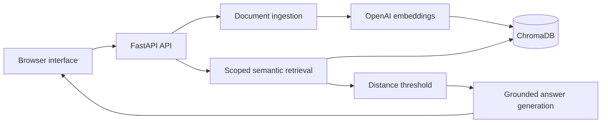

# Document Support RAG Chatbot

[](https://github.com/sasi433/document-support-rag-chatbot/actions/workflows/ci.yml)

A portfolio-scale retrieval-augmented generation (RAG) application for asking questions about support documents. The project accepts text, Markdown, and PDF files, indexes their content in a persistent vector store, and generates answers grounded in retrieved document chunks.

The application includes a FastAPI backend, a lightweight browser interface, structured source references, automated tests, linting, and Docker and Kubernetes deployment support.

## Features

- Upload `.txt`, `.md`, and `.pdf` documents.
- View indexed documents with chunk counts, file size, and modification time.
- Remove uploaded documents and their indexed content.
- Download original documents from the library or an answer's source list.
- Extract and split document text into overlapping chunks.
- Generate embeddings with OpenAI.
- Store and search embeddings with persistent ChromaDB.
- Generate answers using only retrieved document context.
- Ask contextual follow-up questions using recent browser-session history.
- Limit a question to one indexed document or search the full library.
- Return filename, chunk index, and a short snippet for each source.
- Use an explicit fallback when the documents do not contain an answer.
- Run through the browser, REST API, Docker, Docker Compose, or Kubernetes.

## How it works

```text
Document -> Extract text -> Create chunks -> Generate embeddings -> ChromaDB
Question + recent history -> Retrieve chunks -> Generate answer -> Show sources
```



For each question, the application retrieves up to three relevant chunks. Recent conversation history can clarify follow-up intent, but the answer model is instructed to use document context as its only factual evidence. Chunks whose vector distance exceeds `MAX_RETRIEVAL_DISTANCE` are discarded before answer generation. If no relevant chunks remain, the fallback is returned without calling the answer model.

If the context is insufficient, the application returns:

```text
I don't know based on the provided documents.
```

Fallback responses contain an empty `sources` list.

## Technology

- Python 3.11
- FastAPI and Pydantic Settings
- OpenAI embeddings and response generation
- ChromaDB persistent vector storage
- Vanilla HTML, CSS, and JavaScript
- Pytest and Ruff
- Docker and Docker Compose
- Kubernetes

## Project structure

```text
app/
|-- api/          # Health, document upload, and chat routes
|-- core/         # Environment settings and logging
|-- schemas/      # API request and response models
|-- services/     # Loading, chunking, embeddings, retrieval, and Q&A
|-- static/       # Browser interface
`-- utils/        # Upload file handling
data/
|-- uploads/      # Locally uploaded documents
`-- chroma/       # Generated ChromaDB data
docs/             # Demo questions and validation notes
k8s/              # Kubernetes workload, service, configuration, and storage
sample_docs/      # Fictional documents for demonstrations
tests/            # Automated test suite and fixtures
```

## Local setup (Windows PowerShell)

From the project root, create and activate a virtual environment:

```powershell
python -m venv .venv
.\.venv\Scripts\Activate.ps1
```

Install the pinned dependencies:

```powershell
python -m pip install --upgrade pip
python -m pip install -r requirements.txt
```

Create a local environment file:

```powershell
Copy-Item .env.example .env
```

Set `OPENAI_API_KEY` in `.env` before uploading documents or asking questions. The interface and health endpoint can run without a key, but ingestion and chat require one.

Never commit `.env`. It is ignored because it may contain secrets.

## Run locally

```powershell
python -m uvicorn app.main:app --reload
```

Available URLs:

- Browser interface: <http://127.0.0.1:8000/>
- Health check: <http://127.0.0.1:8000/health>
- Interactive API documentation: <http://127.0.0.1:8000/docs>

The health endpoint should return:

```json
{"status": "ok"}
```

## Browser demo

1. Start the application and open <http://127.0.0.1:8000/>.
2. Upload one of the files from `sample_docs/`, such as `company_faq.md`.
3. Confirm it appears under **Indexed documents** with its chunk count.
4. Ask: `What is the refund policy?`
5. Confirm the answer includes source cards with the filename, chunk index, and context snippet.
6. Ask the follow-up: `What about renewal charges?`
7. Confirm the answer understands the refund-policy context and remains grounded in the document.
8. Ask: `What is the CEO's personal phone number?`
9. Confirm the exact fallback message appears without sources.
10. Clear the conversation and confirm the transcript is emptied.
11. Delete the uploaded document and confirm it disappears from the indexed-document list.

The sample documents describe a fictional organization and contain no real credentials or personal data. More supported and fallback examples are available in [docs/demo_questions.md](docs/demo_questions.md).

## API usage

| Method | Endpoint | Purpose |
| --- | --- | --- |
| `GET` | `/health` | Confirm the application is running |
| `GET` | `/documents` | List indexed documents and file metadata |
| `GET` | `/documents/capabilities` | Get supported upload formats and size limit |
| `GET` | `/documents/{filename}/download` | Download an uploaded document |
| `POST` | `/documents/upload` | Save, chunk, embed, and index a document |
| `DELETE` | `/documents/{filename}` | Remove a document and its indexed chunks |
| `POST` | `/chat/ask` | Ask a question using indexed documents |

### Upload a document

```powershell
curl.exe -X POST `
  -F "file=@sample_docs/company_faq.md" `
  http://127.0.0.1:8000/documents/upload
```

Successful response:

```json
{
  "filename": "company_faq.md",
  "status": "uploaded"
}
```

Uploading another document with the same filename is rejected instead of overwriting the existing file. Documents larger than `MAX_UPLOAD_SIZE_MB` receive a `413 Payload Too Large` response. The browser reads the current limit from the API and checks the selected file before uploading; the server always enforces the limit.

### Download a document

```powershell
Invoke-WebRequest `
  -Uri http://127.0.0.1:8000/documents/company_faq.md/download `
  -OutFile company_faq.md
```

Downloads are restricted to supported files inside the upload directory and are returned as non-cacheable attachments.

### List indexed documents

```powershell
Invoke-RestMethod http://127.0.0.1:8000/documents
```

Each document includes its filename, ChromaDB chunk count, file size, UTC modification time, and whether the original file is available to download. Missing original files remain visible as orphaned index entries with null file metadata so they can still be deleted.

### Delete a document

```powershell
Invoke-RestMethod `
  -Method Delete `
  -Uri http://127.0.0.1:8000/documents/company_faq.md
```

Deletion removes both the uploaded file and all of its indexed chunks.

### Ask a question

```powershell
$body = @{ question = "What is the refund policy?" } | ConvertTo-Json
Invoke-RestMethod `
  -Method Post `
  -Uri http://127.0.0.1:8000/chat/ask `
  -ContentType "application/json" `
  -Body $body
```

Response shape:

```json
{
  "answer": "The first subscription payment can be refunded when requested within 14 calendar days.",
  "sources": [
    {
      "filename": "company_faq.md",
      "chunk_index": 1,
      "snippet": "A customer may request a refund for their first subscription payment within 14 calendar days..."
    }
  ]
}
```

Follow-up requests may include up to six recent messages as complete, alternating user/assistant pairs:

```json
{
  "question": "What about renewal charges?",
  "history": [
    {
      "role": "user",
      "content": "What is the refund policy?"
    },
    {
      "role": "assistant",
      "content": "The first subscription payment may be refunded within 14 days."
    }
  ]
}
```

Questions may optionally be limited to one or more indexed filenames. Omitting `documents` or sending an empty list searches the full library:

```json
{
  "question": "What is the refund policy?",
  "documents": ["company_faq.md"]
}
```

Browser conversation history stays in memory for the current page session only. Clearing the conversation or refreshing the page removes it.

## Configuration

Settings are loaded from environment variables and from `.env` when it is present.

| Variable | Default | Purpose |
| --- | --- | --- |
| `APP_NAME` | `document-support-rag-chatbot` | FastAPI application title |
| `APP_ENV` | `local` | Current application environment |
| `LOG_LEVEL` | `INFO` | Minimum console logging level |
| `UPLOAD_DIR` | `data/uploads` | Uploaded document directory |
| `MAX_UPLOAD_SIZE_MB` | `10` | Maximum document upload size in megabytes |
| `OPENAI_API_KEY` | Not set | API key for embeddings and answers |
| `OPENAI_EMBEDDING_MODEL` | `text-embedding-3-small` | Embedding model |
| `OPENAI_CHAT_MODEL` | `gpt-5.6-terra` | Answer-generation model |
| `MAX_RETRIEVAL_DISTANCE` | `1.0` | Maximum accepted vector distance; lower is more relevant |
| `CHROMA_PERSIST_DIR` | `data/chroma` | Persistent vector database directory |
| `CHROMA_COLLECTION_NAME` | `support_documents` | ChromaDB collection name |

Uploaded documents and generated ChromaDB files remain local and are excluded from Git.

## Docker

Make sure Docker Desktop is running.

### Docker image

Build and run the application directly:

```powershell
docker build -t document-support-rag-chatbot .
docker run --rm --name document-support-rag-chatbot -p 8000:8000 --env-file .env document-support-rag-chatbot
```

Data created by this command is removed with the container.

The image includes a health check. For a running container named `document-support-rag-chatbot`, inspect it with:

```powershell
docker inspect --format='{{.State.Health.Status}}' document-support-rag-chatbot
```

### Docker Compose

Docker Compose is recommended when you want uploaded documents and ChromaDB data to persist in the local `data/` directory:

```powershell
docker compose up --build
```

Stop and remove the container and network:

```powershell
docker compose down
```

The application can start without `.env` for interface and health checks. Upload and chat operations still require `OPENAI_API_KEY`.

## Kubernetes

The `k8s/` directory provides a simple, single-instance deployment:

| Manifest | Purpose |
| --- | --- |
| `configmap.yaml` | Supplies non-secret application settings and persistent data paths. |
| `persistent-volume-claim.yaml` | Requests 2 GiB of `ReadWriteOnce` storage for uploaded documents and ChromaDB. |
| `deployment.yaml` | Runs one application pod with resource limits, a restricted security context, persistent storage, and `/health` readiness and liveness probes. |
| `service.yaml` | Exposes the pod inside the cluster on port 8000. |

The deployment expects an image named `document-support-rag-chatbot:latest`. Build it and make it available to your cluster before applying the manifests. For a local cluster, build the image in the cluster's Docker environment or load it using the cluster tool, such as `minikube image load document-support-rag-chatbot:latest` or `kind load docker-image document-support-rag-chatbot:latest`. For another cluster, publish the image to a registry and update `spec.template.spec.containers[0].image` in `deployment.yaml`.

Create the OpenAI secret directly in the target namespace. This command does not store the key in Git:

```powershell
kubectl create secret generic document-support-rag-chatbot-secrets `
  --from-literal=OPENAI_API_KEY="<your-api-key>"
```

Review `configmap.yaml`, then deploy all resources:

```powershell
kubectl apply -f k8s/
kubectl rollout status deployment/document-support-rag-chatbot
kubectl get pods,service,persistentvolumeclaim `
  -l app.kubernetes.io/name=document-support-rag-chatbot
```

The service is intentionally cluster-internal. Forward it locally and verify both the health endpoint and browser interface:

```powershell
kubectl port-forward service/document-support-rag-chatbot 8000:8000
Invoke-RestMethod http://127.0.0.1:8000/health
```

Then open <http://127.0.0.1:8000/>. The PVC is mounted at `/app/data`, so both `/app/data/uploads` and `/app/data/chroma` survive pod replacement. The `Recreate` deployment strategy matches the single-writer local ChromaDB design.

Remove the workload and configuration with:

```powershell
kubectl delete -f k8s/
kubectl delete secret document-support-rag-chatbot-secrets
```

Deleting the PVC removes the Kubernetes storage claim and may permanently delete its data, depending on the cluster's storage-class reclaim policy. Back up any documents you need before removal.

## Tests and linting

Run the automated test suite:

```powershell
python -m pytest -q
```

Run Ruff:

```powershell
python -m ruff check .
```

Both commands should pass before committing changes. GitHub Actions repeats them on every push and pull request to `main`, validates the Kubernetes manifests with Kubeconform, then independently builds the Docker image and smoke-tests the health endpoint and browser interface.

## Release readiness

The v1 release is validated with all of the following checks:

- The full Pytest and Ruff checks pass locally and in GitHub Actions.
- The Docker image builds and its container smoke tests pass.
- The Kubernetes manifests pass strict schema validation.
- The working tree is clean and synchronized with `origin/main`.
- `.env`, uploaded files, and generated ChromaDB data remain untracked.
- The README demo flow works with the fictional sample documents.

This completed v1 scope is suitable for a CV, portfolio website, GitHub profile, and freelance-platform project listing.

## Project scope

This repository is a local, single-user, production-minded portfolio demonstration. Kubernetes support demonstrates portable single-instance deployment; it does not make the application a fully production-ready public SaaS system. The v1 scope intentionally excludes authentication, multi-user document isolation, persistent conversation storage, background processing, rate limiting, malware scanning, monitoring, backups, ingress, autoscaling, and managed cloud infrastructure.
